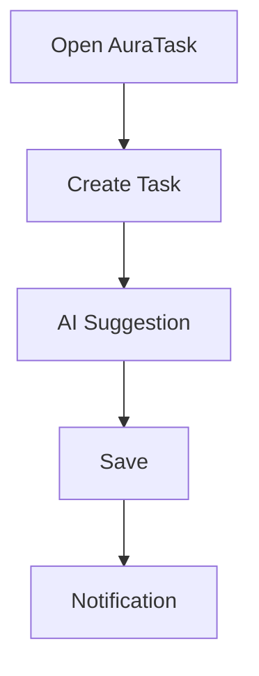

<h1 align="center">
⚡ AuraTask
</h1>

<p align="center">
AI-Powered Productivity App
</p>

<p align="center">

[](https://your-site.com)
[]()
[]()
[]()

</p>

---

# ✨ Features

| Feature | Status |
|---------|--------|
| 🤖 AI Assistant | ✅ |
| 📅 Calendar | ✅ |
| 🔔 Push Notifications | ✅ |
| 📱 PWA | ✅ |
| 🌙 Dark Mode | ✅ |

---

<details>
<summary>📸 Screenshots</summary>

Add your screenshots here.

</details>

---

<details>
<summary>⚙ Installation</summary>

```bash
npm install
npm run dev
```

</details>

---



---

## 📊 Progress

```
█████████████████████ 100%
```

---

⭐ Star this repository if you like it!
